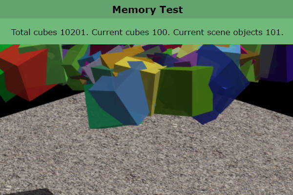

Physijs
=======

This fork of Physijs is compatible with newer Three.js, like r135. The code is
identical to the Chandler Prall's [Physijs](https://github.com/chandlerprall/Physijs),
except for:

- old Geometry is replaced with BufferGeometry;
- classes are compatible with Three.js classes;
- all examples are running (more or less).

These modifications are not thoroughly tested. There might be other parts of
Physijs that need changes.

### Original Physijs examples

Click on an image to run the example:

Memory tests:

